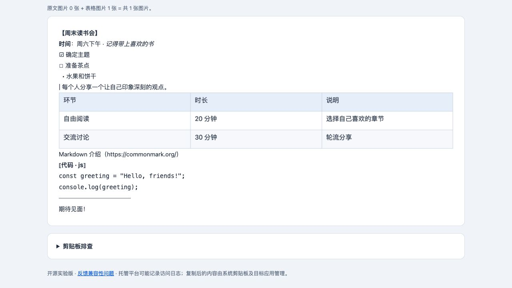

# md2chat · 贴贴 Markdown

把 Markdown 转成适合聊天粘贴的图文：**文字保留为文字，表格转为图片。**

纯前端 · 无需登录 · 无后端服务 · 不上传或持久化保存输入

[在线使用（需先启用 GitHub Pages）](https://forgeturl.github.io/md2chat/) · [兼容性说明](docs/compatibility.md) · [反馈问题](https://github.com/forgeturl/md2chat/issues)

> 当前为实验版。标准图文能否完整粘贴由浏览器、操作系统和聊天客户端共同决定；**没有承诺钉钉、微信全版本无损粘贴**。网页预览正常或复制成功，都不能证明目标聊天框保留了图片。



## 使用

1. 粘贴 Markdown 或图文，查看转换预览。
2. 点击 **转换并复制完整图文**。
3. 到聊天框粘贴，检查图片数量、顺序与排版后再发送。

主流程只有一个复制按钮，剪贴板排查折叠在底部。可以先用页面里的虚构读书会示例体验。

## 功能

- 标题、粗体、斜体、删除线、行内代码和代码块。
- 编号、嵌套列表、任务项、引用、分隔线。
- 链接保留可读地址；代码保留原文和缩进。
- GFM 表格转高清 PNG；较长表格自动分图。
- 原图保留位置；缺失或不能读取的图片会阻止复制并提示补图。
- 同时复制标准 HTML 和纯文本；纯文本包含表格内容，避免目标应用只取纯文本时表格完全丢失。
- 剪贴板排查显示可见格式、大小、图片数量与引用类型；复制的报告不含正文或图片地址。

公式和 Mermaid 暂不渲染；Markdown 内的 HTML 源码按文字显示。网页不能读取或写入原生应用的专有剪贴板格式。

## 图片与隐私

- 默认不请求远程图片。勾选允许后，浏览器才会请求输入中的图片原网址；这些请求不经过本工具服务器，使用 `credentials: omit` 和 `no-referrer`。
- 远程图片可能因 CORS、登录权限、失效链接或网络限制无法读取。请复制图片本身并粘贴到原位置；只有一张缺图时会自动替换，多张缺图请先点击目标图片。
- 本工具没有账号、分析 SDK、内容上传接口，也不使用 localStorage、IndexedDB 或 Service Worker 存储输入。关闭/刷新页面会丢弃内存中的输入和报告。
- 系统剪贴板仍保存你主动复制的内容，目标聊天工具负责其后续处理。GitHub Pages 等托管平台可能记录访问日志。浏览器扩展及系统行为不在本工具控制范围内。
- 不要将敏感内容放进 Issue 或截图。所有内置示例都是虚构通用内容。

## 本地开发

需要 Node.js 22 或更新版本，无需安装依赖：

```sh
git clone https://github.com/forgeturl/md2chat.git
cd md2chat
npm run dev
```

打开终端显示的网址。开发服务仅监听 `127.0.0.1`，支持 `/md2chat/` 子目录，以验证 GitHub Pages 路径。

```sh
npm run check  # 语法检查、Markdown/图片/隐私与发布边界测试
npm run build  # 生成 dist/，只包含公开网页所需资源
```

## 部署 GitHub Pages

1. 仓库 **Settings → Pages → Source** 选择 **GitHub Actions**。
2. 在 **Actions → Check and deploy Pages** 手动运行工作流，或推送到 `main`。
3. 工作流通过后，在 `https://forgeturl.github.io/md2chat/` 访问。

只上传代码不会自动启用 Pages。提供的工作流先测试再部署，PR 只运行检查，不部署。也可把 `dist/` 部署到其他 HTTPS 静态托管；资源路径均为相对路径。

## 项目结构

```text
index.html                 页面与通用示例
assets/app.js              输入、预览、图片和标准剪贴板处理
assets/chat-markdown.js     Marked token → 聊天文字结构
assets/vendor/             固定版本 Marked 及其许可证
scripts/                   静态开发服务、公开资源构建
tests/                     自动化回归测试
```

## 贡献

欢迎提供脱敏的兼容性结果，注明系统、浏览器、聊天工具版本，以及“网页读取 / 复制 / 目标粘贴”哪一步失败。请勿将某个版本上的成功写成全平台保证。

MIT License。依赖许可见 [THIRD_PARTY_NOTICES.md](THIRD_PARTY_NOTICES.md)。
