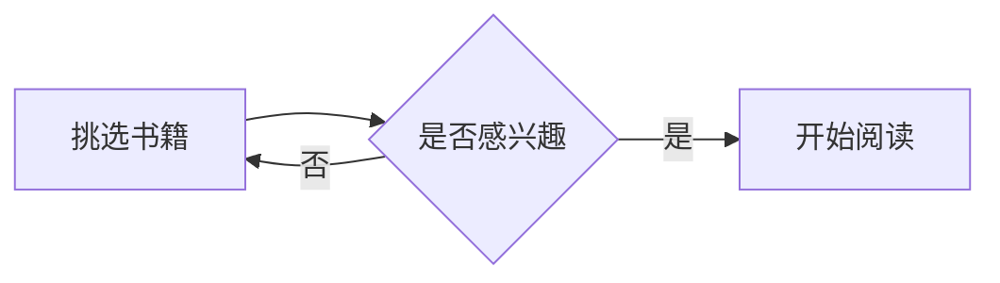
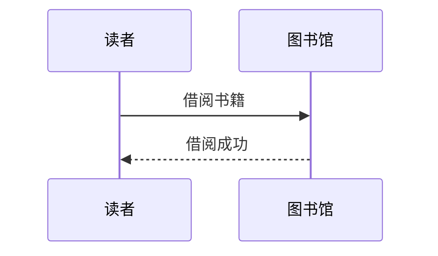

# 数学与读书流程

行内公式 $E=mc^2$ 和 \(a^2+b^2=c^2\) 会保留在句子中。

$$
x=\frac{-b\pm\sqrt{b^2-4ac}}{2a}
$$

```mermaid
flowchart LR
  A[挑选书籍] --> B{是否感兴趣}
  B -->|是| C[开始阅读]
  B -->|否| A
```

```mermaid
sequenceDiagram
  participant R as 读者
  participant L as 图书馆
  R->>L: 借阅书籍
  L-->>R: 借阅成功
```
